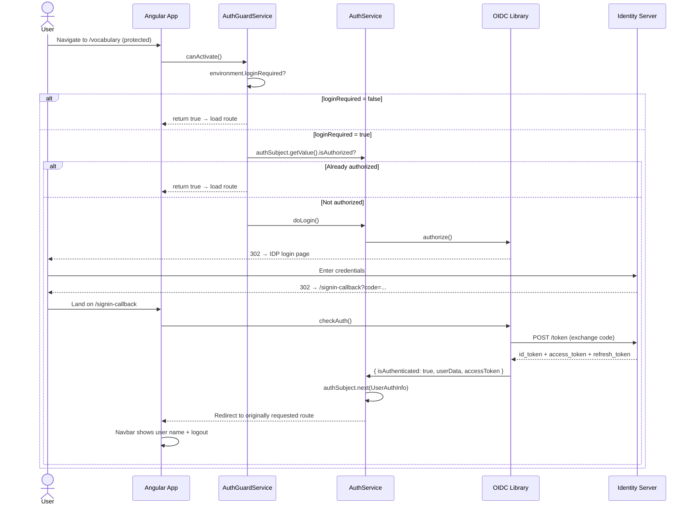
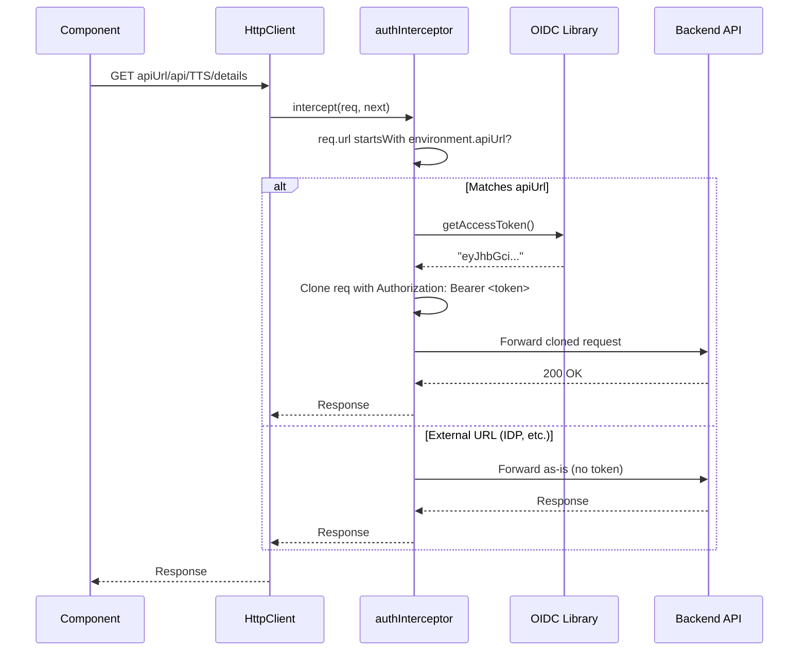
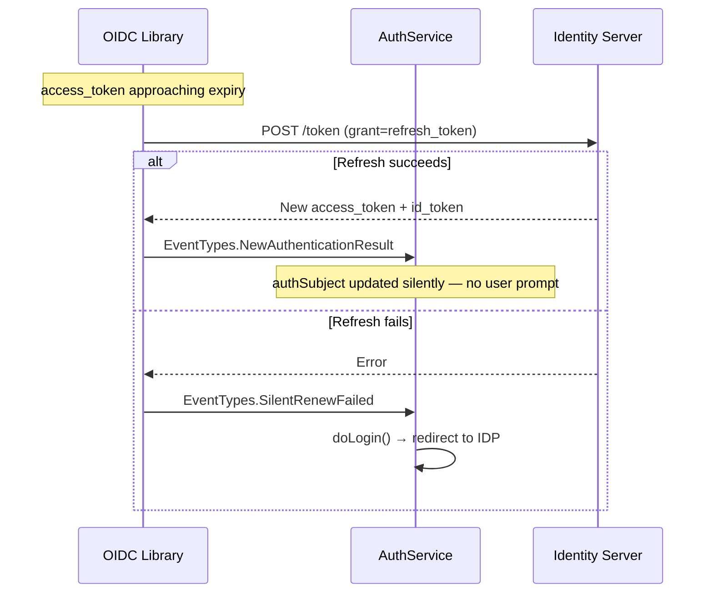
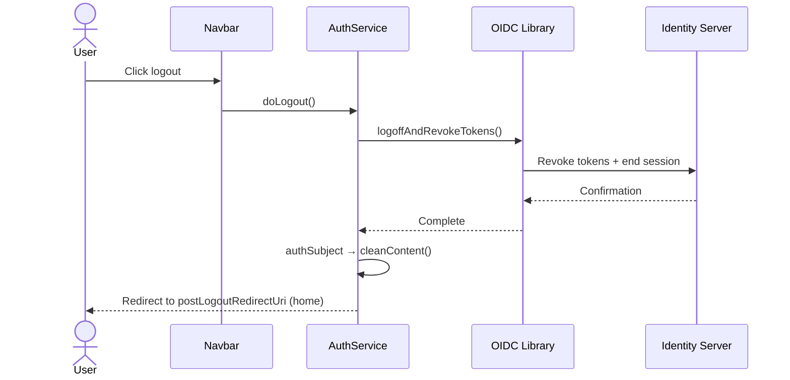

# alvachien.com

My Personal Website

## branch `learning-dev`

Development of web app `learning` folder.

This project was generated with [Angular CLI](https://github.com/angular/angular-cli) version 21.1.2.

### Development server

Run `ng serve` for a dev server. Navigate to `http://localhost:29800/`. The application will automatically reload if you change any of the source files.

### Code scaffolding

Run `ng generate component component-name` to generate a new component. You can also use `ng generate directive|pipe|service|class|guard|interface|enum|module`.

### Build

Run `ng build` to build the project. The build artifacts will be stored in the `dist/` directory.

### Running unit tests

Run `ng test` to execute the unit tests via [Vitest](https://vitest.dev).

### Further help

To get more help on the Angular CLI use `ng help` or go check out the [Angular CLI Overview and Command Reference](https://angular.dev/tools/cli) page.


## Authentication / Login Workflow

The app uses OIDC (OpenID Connect) via [`angular-auth-oidc-client`](https://github.com/damienbod/angular-auth-oidc-client) with Authorization Code flow + PKCE. The ID server settings live in `src/environments/environment*.ts` and are gated by `loginRequired`.

### Login sequence



### API call with Bearer token



### Silent token refresh



### Logout



### Key files

| File | Role |
|---|---|
| `src/app/services/auth.service.ts` | Wraps OIDC library, exposes `authSubject` / `authContent` |
| `src/app/services/auth.interceptor.ts` | Attaches `Bearer` to API-URL requests only |
| `src/app/services/auth-guard.service.ts` | Protects feature routes (`/vocabulary`, `/translating`, etc.) |
| `src/app/services/auth-check.util.ts` | Shared `checkAuthentication()` used by the guard |
| `src/app/interfaces/user-auth-info.ts` | `UserAuthInfo` model (isAuthorized, userName, accessToken, …) |
| `src/app/pages/signin-callback/` | Landing page after IDP redirect |
| `src/app/app.config.ts` | Calls `provideAuth({...})` + registers the interceptor |
| `src/app/app.routes.ts` | Wires `canActivate: [AuthGuardService]` on feature routes |
| `src/app/shared/navbar/` | Login / user-menu / logout UI |
| `src/environments/environment*.ts` | `loginRequired`, `idServerUrl`, `oidcClientId`, `oidcScope`, … |

### Configuration

`loginRequired` controls whether the guard actually blocks navigation:

| Env | `loginRequired` | Behaviour |
|---|---|---|
| `environment.ts` (dev) | `false` | All routes accessible — auth is wired but passive |
| `environment.prod.ts` | `true` | Feature routes require a valid session |

To activate login on dev, flip `loginRequired` to `true` and point `idServerUrl` / `oidcClientId` / `oidcScope` at a real identity server whose allowed redirect URIs include `${appHost}/signin-callback`.


## Documentation

- [Knowledge Exercises Sequence Diagrams](docs/knowledge-exercises-sequence.md) — Mermaid sequence diagrams for the Knowledge Bank feature: initialization (API + metadata merge), file selection, rating changes, and preview flow.


## Responsive Layout

The app adapts to different screen sizes with a three-tier layout (minimum width: 360px — supports most mobile phones in portrait):

| Breakpoint | Navbar | Sub-page Toolbars |
|---|---|---|
| **>1200px** | Full labels, user name visible | Normal layout with all controls |
| **821–1200px** | Abbreviated labels (Voc, Sent, etc.), icon-only user button | Compact single-row, item count hidden |
| **≤820px** | Hamburger menu with slide-out drawer | Two-row layout, smaller buttons |


## Tools

### `fix-json-ids.js`

A tool to fix the ids of items in a JSON file.

#### Usage

1. Place the script in the same directory as the JSON file you want to fix.
2. Run the script using Node.js:
```
node tools/fix-json-ids.js
```
3. The script will modify the JSON file in place, adding or updating the `id` field for each item.

### `quizConverter.js`

A tool which parse the text file and convert it to JSON format.

Each line in the text file defines a question. And each question contain 4 options:

An example:

```txt
A. shine B. fly C. dance D. score
A. fly B. shine C. score D. dance
```

#### Usage

1. Place the script in the same directory as the text file you want to convert.
2. Run the script using Node.js:
```
node tools/quizConverter.js
```
3. The script will output the JSON format of the questions to the console.
4. You can redirect the output to a file if needed:
```
node tools/quizConverter.js > questions.json
```


### `parse_questions.ps1`

A PowerShell wrapper that calls `parse_questions.py` to parse question text files into JSON format.

#### Usage

1. Navigate to the `tools` folder:
```
cd tools
```
2. Update `question.txt` with your questions.
3. Execute the script from the same folder:
```
.\parse_questions.ps1 wk16-friday-
```
4. Check the result in `questions.json` under the same `tools` folder.

### `parse_questions.py`

A Python script that parses question text files into structured JSON. Called by `parse_questions.ps1`.

#### Usage

Run directly with Python:
```
python tools/parse_questions.py <input_file> <output_file> [prefix]
```


### `convertTextToJson.js`

A tool which parse the text file and convert it to JSON format.

The text file use blank line to separate each question. And each question contain 5 lines:

1. The question stem
2. The options (A, B, C, D)

An example:

```txt
Question 1.
A. shine
B. fly
C. dance
D. score

Question 2.
A. shine
B. fly
C. dance
D. score
```

#### Usage

1. Place the script in the same directory as the text file you want to convert.
2. Run the script using Node.js:
```
node tools/convertTextToJson.js
```
3. The script will output the JSON format of the questions to the console.
4. You can redirect the output to a file if needed:
```
node tools/convertTextToJson.js > questions.json
```

