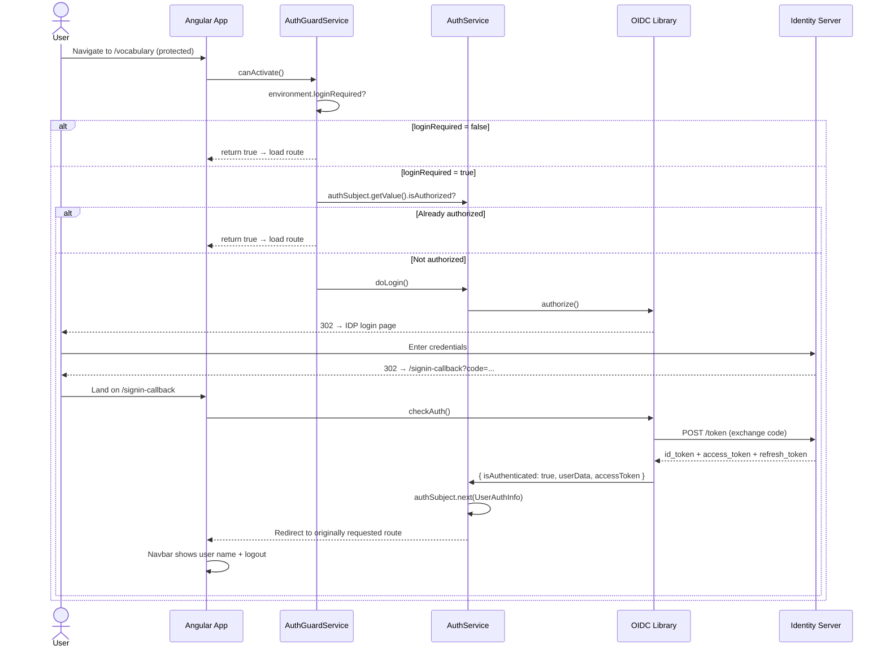
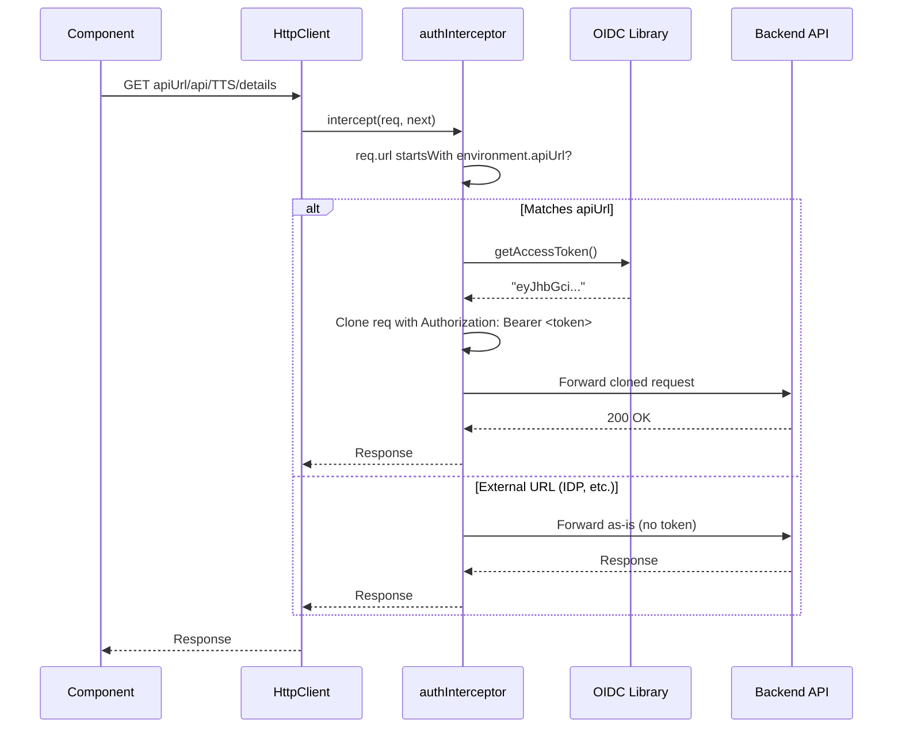
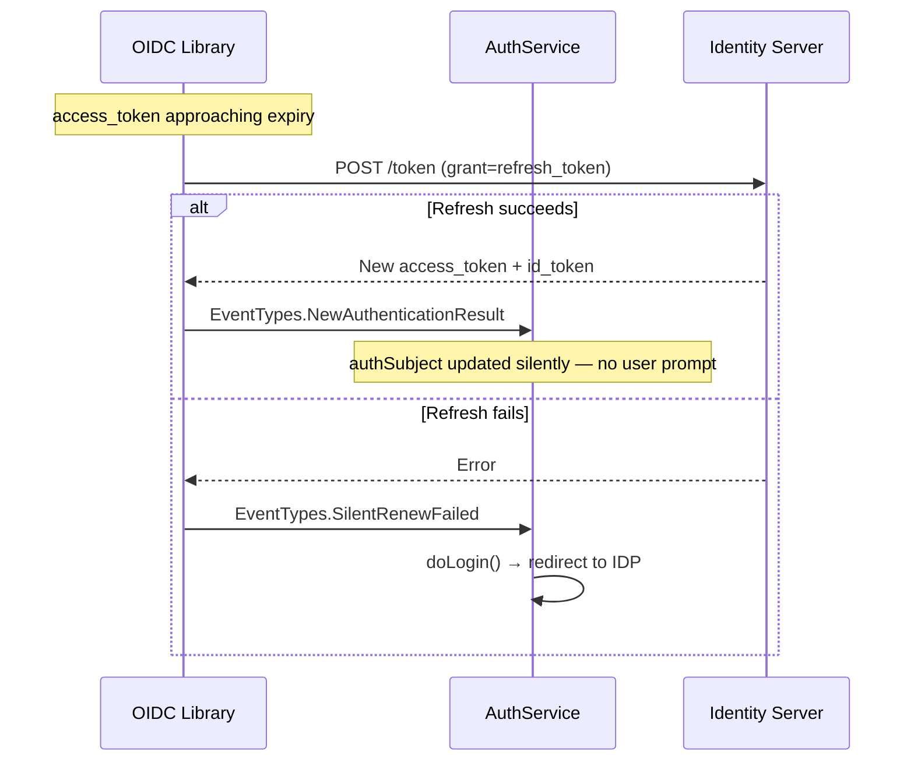
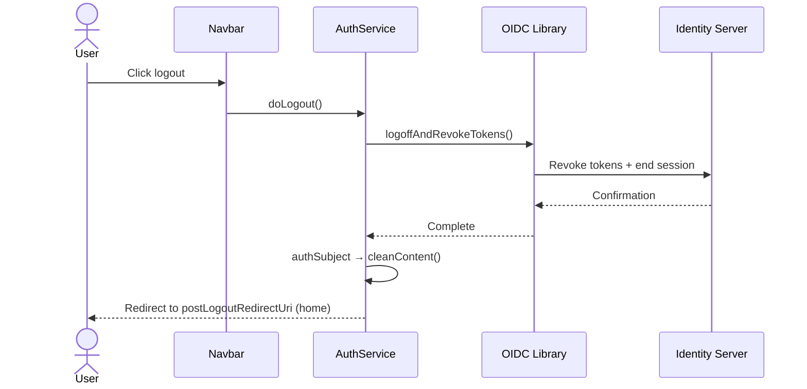

# Authentication / Login Workflow

The app uses OIDC (OpenID Connect) via [`angular-auth-oidc-client`](https://github.com/damienbod/angular-auth-oidc-client) with Authorization Code flow + PKCE. The ID server settings live in `src/environments/environment*.ts` and are gated by `loginRequired`.

## Login sequence

## API call with Bearer token

## Silent token refresh

## Logout

## Key files

| File | Role |
|---|---|
| `src/app/services/auth.service.ts` | Wraps OIDC library, exposes `authSubject` / `authContent` |
| `src/app/services/auth.interceptor.ts` | Attaches `Bearer` to API-URL requests only |
| `src/app/services/auth-guard.service.ts` | Protects feature routes (`/vocabulary`, `/translating`, etc.) |
| `src/app/services/auth-check.util.ts` | Shared `checkAuthentication()` used by the guard |
| `src/app/interfaces/user-auth-info.ts` | `UserAuthInfo` model (isAuthorized, userName, accessToken, …) |
| `src/app/pages/signin-callback/` | Landing page after IDP redirect |
| `src/app/app.config.ts` | Calls `provideAuth({...})` + registers the interceptor |
| `src/app/app.routes.ts` | Wires `canActivate: [AuthGuardService]` on feature routes |
| `src/app/shared/navbar/` | Login / user-menu / logout UI |
| `src/environments/environment*.ts` | `loginRequired`, `idServerUrl`, `oidcClientId`, `oidcScope`, … |

## Configuration

`loginRequired` controls whether the guard actually blocks navigation:

| Env | `loginRequired` | Behaviour |
|---|---|---|
| `environment.ts` (dev) | `false` | All routes accessible — auth is wired but passive |
| `environment.prod.ts` | `true` | Feature routes require a valid session |

To activate login on dev, flip `loginRequired` to `true` and point `idServerUrl` / `oidcClientId` / `oidcScope` at a real identity server whose allowed redirect URIs include `${appHost}/signin-callback`.
