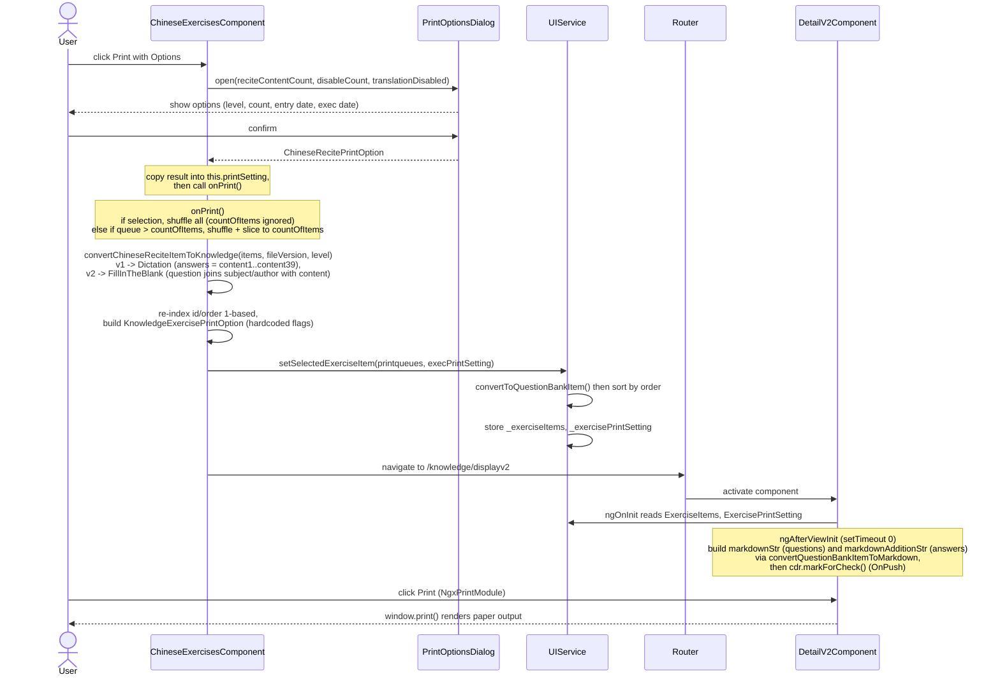

# Chinese Print

Investigated 2026-07-10.

## Print Process

Printing the Chinese reciting exercise reuses the shared Knowledge Bank print renderer. The Chinese component converts each `LearnChineseFileItem` (poem: subject / author / content) into a Knowledge-Bank question (`Dictation` for file v1, `FillInTheBlank` for file v2) and hands it off via `UIService`, then routes to the shared `displayv2` page.



The numbered subsections below detail each step.

### 1. Print options dialog

`src/app/pages/chinese-exercises/chinese-exercises.component.ts:359` (`onPrintWithOptions`) opens `ChineseExercisesPrintOptionsDialogComponent` (defined at `:568`, template `chinese-exercises-printoptions-dialog.html`) with:

- `reciteContentCount` - selection length if rows are selected, else total loaded item count
- `disableCount` - whether any rows are manually selected (disables the count input)
- `translationDisabled` - the selected file's translation flag

The dialog collects these settings into a `ChineseRecitePrintOption` (`src/app/interfaces/chinese-recite-status.ts:24`, extending `ChineseRecitetOptionAbstract`):

| Field | Meaning |
|---|---|
| `selectedLevel` | question difficulty level (`QuestionBankItemLevelEnum`) |
| `countOfItems` | cap on number of items (input is disabled when `disableCount`) |
| `printEntryDate` | collected, not currently consumed by the renderer |
| `answerLineBreakPerItem` | when `true`, the answer key renders one item per line (consumed - see [Answer Line Break](#answer-line-break)) |
| `respectRetentionCurve` | set `true` when the Exec. Date radio is at option `1`; collected, not currently consumed |
| `printExecDate` | set `true` when the Exec. Date radio is at option `2`; collected, not currently consumed |
| `execDate` | the chosen date when `printExecDate` is `true`; collected, not currently consumed |

The assembly happens in `onYesClick()` (`:590-603`): the Exec. Date radio (`selectedExecDateModel`) maps `1` -> `respectRetentionCurve`, `2` -> `printExecDate` + `execDate`.

### 2. Building the print queue

`src/app/pages/chinese-exercises/chinese-exercises.component.ts:392-435` (`onPrint`):

- **With a manual selection** (`selection.selected.length > 0`): the queue is `convertChineseReciteItemToKnowledge(this.selection.selected, ...)`, then shuffled. `countOfItems` is **ignored** - all selected rows print.
- **Without a selection**: the queue is `convertChineseReciteItemToKnowledge(this.dataSource.data, ...)`; if it is longer than `countOfItems` it is shuffled and sliced to `countOfItems`; if it is already shorter, all items print (no shuffle, no padding). So `countOfItems` is a **ceiling**, not an exact count.

`convertChineseReciteItemToKnowledge` (`src/app/interfaces/learnchinese.ts:114`) maps each `LearnChineseFileItem` to a `KnowledgeExerciseFileContent`:

- `itemType` = `QuestionBankTypeEnum.FillInTheBlank` when `fileVersion === 2`, else `QuestionBankTypeEnum.Dictation`.
- `id` / `order` = 1-based index (later overwritten by `onPrint` to a fresh 1-based sequence after shuffle/slice).
- `questionLevel` = `selectedLevel`.
- **FillInTheBlank (v2)**: `question` = `${subject}, ${author}. ${content}` (or `${subject}. ${content}` with no author). The `content` carries `@…@` regions that become blanks (the list view strips them with `replaceAll('@', '')` for display).
- **Dictation (v1)**: `question` = `${subject}, ${author}` (or `${subject}`); `answers` is built from the line-by-line `content1..content39` fields (driven by `contentlength`), falling back to a single `content` entry.

After conversion, `onPrint` re-indexes `order`/`id` to a 1-based sequence (`:417-420`), then assembles a `KnowledgeExercisePrintOption` (`:423-431`) with `formTitle = nameChinese + " (" + levelName + ")"`, `printEntryDate = true`, `printScore = true`, `printAnswer = true`, `printID = false`, `printHintOfAnswer = false`, `hideLabelOfQuestionType = [FillInTheBlank]` (so the question-type label is suppressed for fill-in-the-blank), and `answerLineBreakPerItem = this.printSetting.answerLineBreakPerItem ?? false` (the one Chinese-specific option forwarded to the renderer - see [Answer Line Break](#answer-line-break)). Then `uiService.setSelectedExerciseItem(printqueues, execPrintSetting)` is called and the router navigates to `/knowledge/displayv2` (`:433-434`).

### 3. Handoff via UIService

`src/app/services/ui.service.ts:32-94` (`setSelectedExerciseItem`):

- Converts each `KnowledgeExerciseFileContent` to a concrete `QuestionBankItemBase` via `convertToQuestionBankItem`.
- Sorts by `order`.
- Optionally shuffles single/multiple-choice options (not relevant for dictation / fill-in-the-blank).
- Stores `_exerciseItems` and `_exercisePrintSetting` for the renderer to read.

### 4. Rendering (`displayv2`)

`src/app/pages/knowledge-exercises/knowledge-exercises-detail-v2/knowledge-exercises-detail-v2.component.ts`:

- `ngOnInit` (`:49-53`): reads `uiService.ExerciseItems` -> `questions` and `ExercisePrintSetting` -> `printSetting`.
- `ngAfterViewInit` (`:60-95`): builds two Markdown strings inside `setTimeout(..., 0)` (deferred to avoid `ExpressionChangedAfterItHasBeenChecked`):
  - `markdownStr` - a header (`formTitle`, `printID` ISO timestamp, Date/Duration/Score blanks) followed by each question rendered via `convertQuestionBankItemToMarkdown`.
  - `markdownAdditionStr` - the answer key, via `convertQuestionBankItemAnswerToMarkdown`, shown when `printAnswer` is set.
  - `cdr.markForCheck()` is called because the component is `OnPush`.
- The actual browser print is triggered by `NgxPrintModule` (`:8, :27`).

## Unconsumed Print Options

**Scope:** Printing flow for the Chinese exercise (`pages/chinese-exercises/`) -> shared knowledge print renderer (`pages/knowledge-exercises/knowledge-exercises-detail-v2/`).

### Question

The print-options dialog collects `printEntryDate`, `respectRetentionCurve`, `printExecDate`, and `execDate`. Do these reach the rendered output?

### Answer

**No.** All four are stored into `this.printSetting` (a `ChineseRecitePrintOption`) when the dialog closes, but `onPrint()` builds a **separate** `KnowledgeExercisePrintOption` (`execPrintSetting`) with hardcoded booleans and never reads them back. Additionally, `KnowledgeExercisePrintOption` has no fields for `respectRetentionCurve`, `printExecDate`, or `execDate` at all - those exist only on `ChineseRecitePrintOption`. So the dialog's "Print Entry Date" checkbox and the entire "Exec. Date Option" radio (plus the datepicker) are collected and stored, but have **no effect** on the rendered print today.

### How it works (current)

Signal path:

1. The dialog (`ChineseExercisesPrintOptionsDialogComponent`, `chinese-exercises.component.ts:568`) collects the four fields. `onYesClick()` (`:590-603`) maps the Exec. Date radio into `respectRetentionCurve` / `printExecDate` / `execDate` and closes with a `ChineseRecitePrintOption`.
2. The `afterClosed` subscriber (`:375-389`) copies the result into `this.printSetting`, then calls `onPrint()`.
3. `onPrint()` (`:392-435`) ignores `this.printSetting`'s four date/entry fields and constructs `execPrintSetting` from scratch - the sole exception being `answerLineBreakPerItem`, which **is** forwarded (see [Answer Line Break](#answer-line-break)):

```ts
const execPrintSetting: KnowledgeExercisePrintOption = {
  formTitle: this.selectedFile?.nameChinese
    ? `${this.selectedFile.nameChinese}`
    : this.getDefaultFormTitle(),
  printEntryDate: true,
  printScore: true,
  printAnswer: true,
  printID: false,
  printHintOfAnswer: false,
  hideLabelOfQuestionType: [QuestionBankTypeEnum.FillInTheBlank],
  answerLineBreakPerItem: this.printSetting.answerLineBreakPerItem ?? false,
};
```

`this.printSetting.printEntryDate` is shadowed by the hardcoded `printEntryDate: true`; `respectRetentionCurve`, `printExecDate`, and `execDate` are dropped entirely. (`answerLineBreakPerItem` is the only Chinese-specific option that survives into `execPrintSetting`.)

4. `execPrintSetting` is passed to `uiService.setSelectedExerciseItem`, so `UIService._exercisePrintSetting` (and therefore `displayv2`) sees only what `execPrintSetting` carries - the four date/entry options never reach the renderer.

### Type mismatch

The two option types do not align:

```ts
// src/app/interfaces/chinese-recite-status.ts:24
export interface ChineseRecitePrintOption extends ChineseRecitetOptionAbstract {
  printEntryDate?: boolean;
  respectRetentionCurve?: boolean;
  printExecDate?: boolean;
  execDate?: Date;
  answerLineBreakPerItem?: boolean;
}

// src/app/interfaces/questionbank-base.ts:1363
export interface KnowledgeExercisePrintOption {
  formTitle: string;
  printEntryDate: boolean;
  printScore: boolean;
  printAnswer: boolean;
  printHintOfAnswer: boolean;
  printID: boolean;
  hideLabelOfQuestionType: QuestionBankTypeKeys[];
  shuffleOptionsInSelection?: boolean;
  uniformBlankLength?: boolean;
  uniformBlankLengthSize?: number;
  answerLineBreakPerItem?: boolean;
}
```

`KnowledgeExercisePrintOption` carries no retention-curve / exec-date fields, so even if `onPrint()` wanted to forward them it would have nowhere to put them without extending the shared interface (which would affect the Knowledge Bank and Vocabulary print paths too). `answerLineBreakPerItem` is the exception: it was added to **both** interfaces and is the only Chinese-specific option that flows all the way to the renderer (see [Answer Line Break](#answer-line-break)).

### Notes

- `selectedLevel`, `countOfItems`, and `answerLineBreakPerItem` **are** consumed: `selectedLevel` is passed to `convertChineseReciteItemToKnowledge` and also appended to `formTitle`; `countOfItems` gates the shuffle-and-slice ceiling; `answerLineBreakPerItem` is forwarded to the renderer (see [Answer Line Break](#answer-line-break)). Only the four date/entry options are dead.
- `printEntryDate` on `KnowledgeExercisePrintOption` is itself not read by the `displayv2` renderer (the header always prints Date/Duration/Score blanks gated by `printScore`, not `printEntryDate`), so even the hardcoded `printEntryDate: true` has no visible effect - it is doubly inert here.
- Because the hand-off is in-memory via `UIService` (not route state), a hard refresh on `/knowledge/displayv2` yields a blank sheet - the items only exist for the lifetime of that navigation.

## Answer Line Break

**Scope:** Printing flow for the Chinese exercise (`pages/chinese-exercises/`) -> shared knowledge print renderer (`pages/knowledge-exercises/knowledge-exercises-detail-v2/`).

### Question

The Chinese answer key (`markdownAdditionStr`) historically ran every item's answer together on one line, joined by `&emsp;` (an em-space). For multi-poem prints this is hard to read. Can each item's answer sit on its own line?

### Answer

**Yes - optionally.** A new "One Answer per Line" checkbox in the print-options dialog toggles `answerLineBreakPerItem`. When on (the default), items are separated by a line break (`\n`) instead of `&emsp;`, so each item's answer prints on its own line. When off, the legacy inline behavior is unchanged. The line break is **between items only** - a single item's multiple answers (e.g. a dictation poem's lines) still join with `, ` on that one line.

### How it works (current)

Signal path:

1. The print-options dialog (`ChineseExercisesPrintOptionsDialogComponent`, `chinese-exercises.component.ts:568`) collects `answerLineBreak` (checkbox, default on). `onYesClick()` (`:590-603`) packs it as `answerLineBreakPerItem` into the `ChineseRecitePrintOption` returned to the caller.
2. The `afterClosed` subscriber (`:375-389`) copies it into `this.printSetting.answerLineBreakPerItem`.
3. `onPrint()` (`:423-431`) forwards it onto the shared `KnowledgeExercisePrintOption`:

```ts
answerLineBreakPerItem: this.printSetting.answerLineBreakPerItem ?? false,
```

This is the one Chinese-specific option that reaches `execPrintSetting` (the four date/entry options do not - see [Unconsumed Print Options](#unconsumed-print-options)).

4. `displayv2`'s `ngAfterViewInit` (`knowledge-exercises-detail-v2.component.ts`, `:77-90`) reads it when joining answer items:

```ts
const answerItemSeparator = this.printSetting?.answerLineBreakPerItem ? '\n' : '&emsp;';
this.questions.forEach((item, idx) => {
  this.markdownAdditionStr +=
    convertQuestionBankItemAnswerToMarkdown(item) +
    (this.printSetting?.printHintOfAnswer && item.hintofanswer
      ? `; &emsp;${item.hintofanswer}; `
      : '') +
    (idx === this.questions.length - 1 ? '' : answerItemSeparator);
});
```

`\n` renders as a line break because `MarkedService` runs with `breaks: true` (`src/app/services/marked.service.ts`), so a single newline becomes `<br>`.

### Notes

- Only the **between-item** joiner changes. The within-item join (`answers.join(', ')` inside `convertQuestionBankItemAnswerToMarkdown`) and the `printHintOfAnswer` suffix (`; &emsp;…; `) are untouched, per the "between items only" scope.
- The question section (`markdownStr`) is unaffected - it already separates items with `\n`.
- `answerLineBreakPerItem` lives on **both** `ChineseRecitePrintOption` (dialog -> component) and `KnowledgeExercisePrintOption` (component -> renderer), because `onPrint()` rebuilds the print setting as the shared type before handing it to `UIService`.
- Other print sources (Vocabulary, Knowledge Bank, Translate, Formula) leave the flag unset, so their answer keys keep the inline `&emsp;` joiner unchanged.
