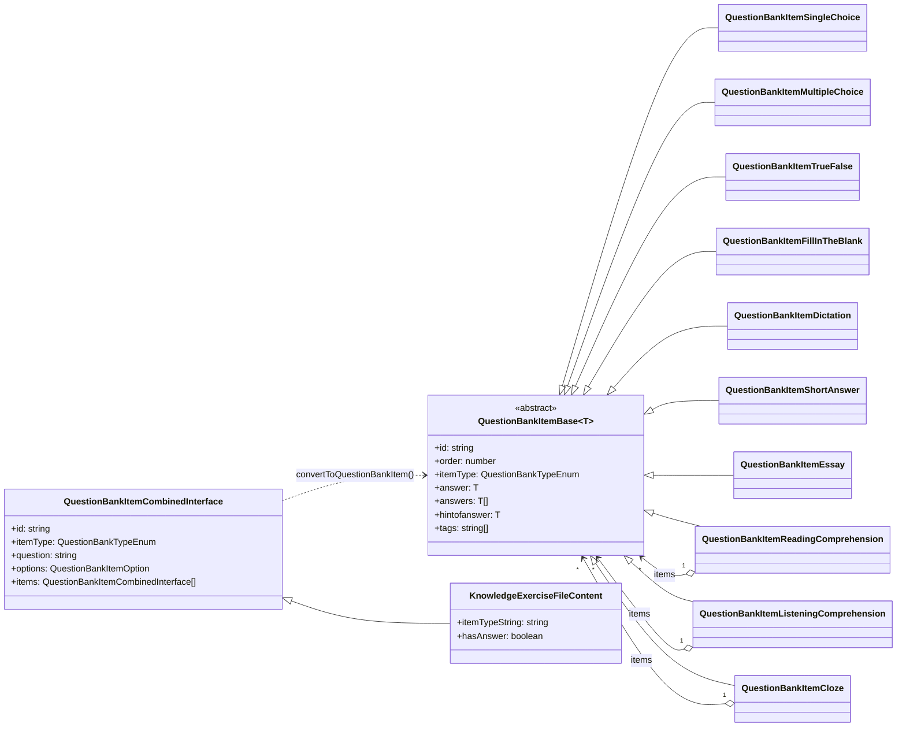
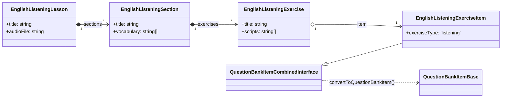
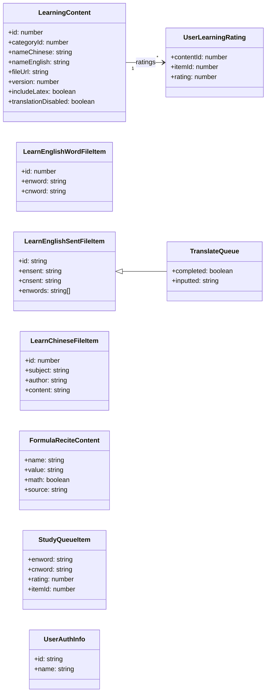
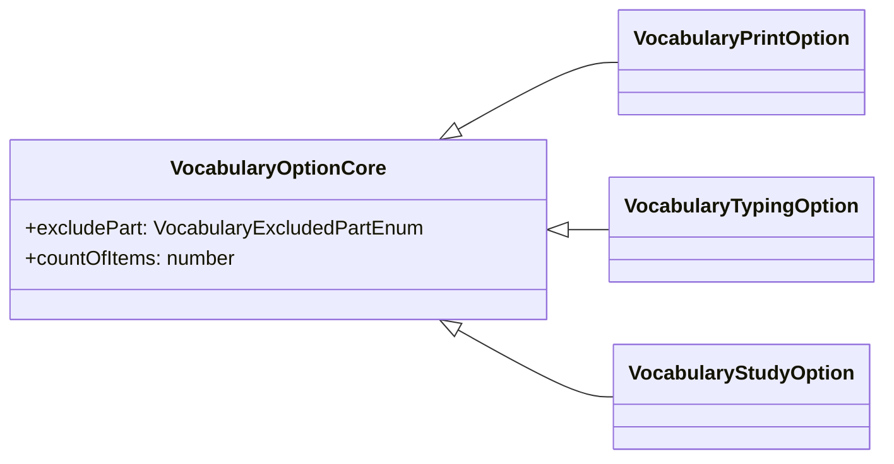
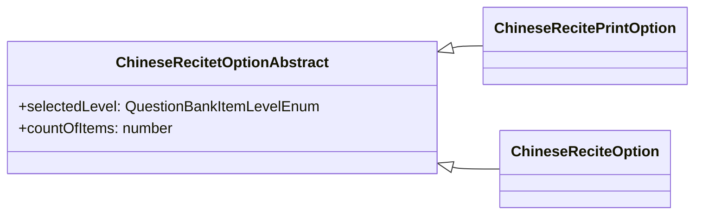

## Data Models

`src/app/interfaces/` defines the data model. 

Each content category maps to a concrete data model loaded by `LearningContentService` (see [Content Data](#content-data) for the full category → method → storage-subfolder table). `LearningContent` is the common file-list record the API returns for every category; the per-category content models are:

| Cat ID | Category | Content data model | Interface file |
|---|---|---|---|
| 1 | Vocabulary | `LearnEnglishWordFileItem` | `learnenglish.ts` |
| 2 | Sentences | `LearnEnglishSentFileItem` (`TranslateQueue extends` it) | `learnenglish.ts` / `translate-data.ts` |
| 3 | Listening | `EnglishListeningLesson` → `EnglishListeningSection` → `EnglishListeningExercise` → `EnglishListeningExerciseItem` | `english-listening.ts` |
| 4 | Chinese | `LearnChineseFileItem` | `learnchinese.ts` |
| 5 | Formula | `FormulaReciteContent` | `formula-recite-queue.ts` |
| 6 | Knowledge Bank | `KnowledgeExerciseFileContent` → `QuestionBankItemBase` via `convertToQuestionBankItem()` | `questionbank-base.ts` |

- **QuestionBank** (`interfaces/questionbank.ts`) — Enums for question types (`QuestionBankTypeEnum`), content formats, option keys, and item levels.
- **QuestionBankItemBase** (`interfaces/questionbank-base.ts`) — Abstract base class for all question types. Concrete implementations: `QuestionBankItemSingleChoice`, `QuestionBankItemMultipleChoice`, `QuestionBankItemFillInTheBlank`, `QuestionBankItemDictation`, `QuestionBankItemShortAnswer`, `QuestionBankItemEssay`, `QuestionBankItemReadingComprehension`, `QuestionBankItemListeningComprehension`, `QuestionBankItemCloze`, `QuestionBankItemTrueFalse`.
- **convertToQuestionBankItem()** — Converts `QuestionBankItemCombinedInterface` (raw JSON) to concrete `QuestionBankItemBase` instances.

The diagram shows the core `QuestionBankItemBase` hierarchy, the raw-JSON `QuestionBankItemCombinedInterface` that `convertToQuestionBankItem()` turns into concrete items, the content-record types loaded by `LearningContentService`, and the option/queue interfaces.

### Listening

### Mapping with API Structure

### Vocabulary Options

### Chinese Options

Enums (`QuestionBankTypeEnum`, `QuestionBankContentFormatEnum`, `QuestionBankItemLevelEnum`, `SelectionModeEnum`, `RatingOperatorEnum`, `PrintExecDateEnum`, `ChineseReciteStatusEnum`, `EnglishListeningStatusEnum`, `TranslateDirectionEnum`, `VocabularyExcludedPartEnum`, `FormulaReciteAIModeEnum`, `TranslationAIModeEnum`, etc.) and the status/queue interfaces (`VocabularyTypingQueue`, `VocabularyTypingQueueResult`, `VocabularyWordLetter`, `TranslateExerciseUIStatus`, `ChineseReciteStatus`, `EnglishListeningUIStatus`) are omitted from the diagram for readability.
