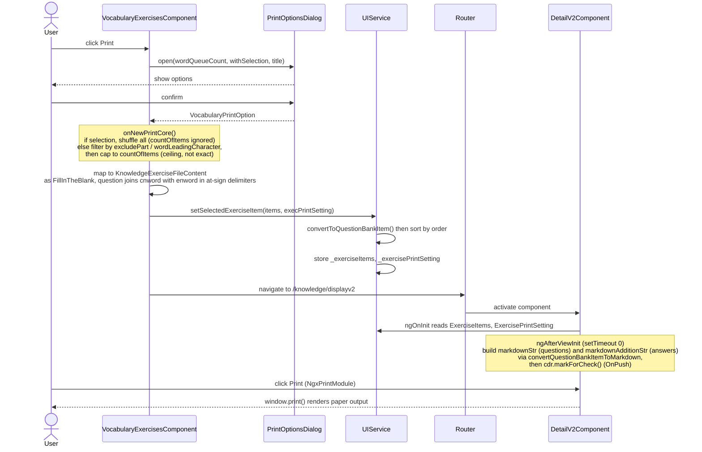

# Vocabulary Print

Investigated 2026-07-10.

## Print Process

Printing the vocabulary exercise reuses the shared Knowledge Bank print renderer. The vocabulary component builds fill-in-the-blank items and hands them off via `UIService`, then routes to the shared `displayv2` page.



The numbered subsections below detail each step.

### 1. Print options dialog

`src/app/pages/vocabulary-exercises/vocabulary-exercises.component.ts:914-958` (`onPrintWithOptions`) opens `VocabularyExercisesPrintOptionsDialogComponent` (defined at `:1290-1351`, template `vocabulary-exercises-printoptions-dialog.html`) with:

- `wordQueueCount` - selection length if rows are selected, else total loaded word count
- `withSelection` - whether any rows are manually selected
- `title` - the selected file's `nameEnglish`

The dialog collects these settings into a `VocabularyPrintOption` (`src/app/interfaces/vocabulary.ts:35-40`, extending `VocabularyOptionCore`):

| Field | Meaning |
|---|---|
| `subTitle` | becomes the printed form title |
| `excludePart` | filter out single words (`word`) or multi-word phrases (`phase`) |
| `wordLeadingCharacter` | keep only words starting with one of the chosen letters |
| `countOfItems` | cap on number of items (input is disabled when `withSelection`) |
| `printEntryDate` | collected, not currently consumed by the renderer |
| `printFirstLetter` | prepend the answer's first letter to the blank |

### 2. Building the print queue

`src/app/pages/vocabulary-exercises/vocabulary-exercises.component.ts:960-1016` (`onNewPrintCore`):

- **With a manual selection** (`selection.selected.length > 0`): the queue is the selected rows, shuffled. `countOfItems` is **ignored** - all selected rows print.
- **Without a selection**: the queue is the full `dataSource.data`, filtered by `excludePart` and `wordLeadingCharacter`, then capped: if the filtered queue is longer than `countOfItems` it is shuffled and sliced to `countOfItems`; if it is already shorter, all items print (no shuffle, no padding). So `countOfItems` is a **ceiling**, not an exact count.

Each queue item is mapped to a `KnowledgeExerciseFileContent` (`:995-1004`) with:

- `itemType: QuestionBankTypeEnum.FillInTheBlank`
- `id` / `order` = 1-based index
- `question` = `cnword[0..50] [firstLetter?] @enword@` - the `@…@` region is the answer placeholder that later becomes the blank.

A `KnowledgeExercisePrintOption` is assembled (`:1005-1014`) with `formTitle = subTitle`, `printAnswer = true`, `printScore = true`, `printID = false`, `hideLabelOfQuestionType = [FillInTheBlank]` (so the "填空题" label is suppressed), and `uniformBlankLength = true` (so the blank does not reveal the answer's length - see [Blank Length](#blank-length)). Then `uiService.setSelectedExerciseItem(items, execPrintSetting)` is called and the router navigates to `/knowledge/displayv2` (`:1015-1016`).

### 3. Handoff via UIService

`src/app/services/ui.service.ts:32-94` (`setSelectedExerciseItem`):

- Converts each `KnowledgeExerciseFileContent` to a concrete `QuestionBankItemBase` via `convertToQuestionBankItem`.
- Sorts by `order`.
- Optionally shuffles single/multiple-choice options (not relevant for fill-in-the-blank).
- Stores `_exerciseItems` and `_exercisePrintSetting` for the renderer to read.

### 4. Rendering (`displayv2`)

`src/app/pages/knowledge-exercises/knowledge-exercises-detail-v2/knowledge-exercises-detail-v2.component.ts`:

- `ngOnInit` (`:49-53`): reads `uiService.ExerciseItems` -> `questions` and `ExercisePrintSetting` -> `printSetting`.
- `ngAfterViewInit` (`:60-95`): builds two Markdown strings inside `setTimeout(..., 0)` (deferred to avoid `ExpressionChangedAfterItHasBeenChecked`):
  - `markdownStr` - a header (`formTitle`, `printID` ISO timestamp, Date/Duration/Score blanks) followed by each question rendered via `convertQuestionBankItemToMarkdown`.
  - `markdownAdditionStr` - the answer key, via `convertQuestionBankItemAnswerToMarkdown`, shown when `printAnswer` is set.
  - `cdr.markForCheck()` is called because the component is `OnPush`.
- The actual browser print is triggered by `NgxPrintModule` (`:8, :27`).

## Blank Length

**Scope:** Printing flow for the Vocabulary exercise (`pages/vocabulary-exercises/`) -> shared knowledge print renderer (`pages/knowledge-exercises/knowledge-exercises-detail-v2/`).

### Question

When a vocabulary item such as `enword: "test"`, `cnword: "n. 测试"` is printed, the printable form is `n. 测试 _____`.
Does the `_____` blank reflect the length of the English word (4 in this case)?

### Answer

**No - not for vocabulary.** Vocabulary prints render the blank at a **fixed uniform width** that does not reflect the English word's length. A 4-letter word and a 12-letter word produce the same blank; the blank deliberately hides the answer's length. Knowledge Bank FillInTheBlank prints still use the legacy length-proportional blank (see [Historical: the legacy proportional path](#historical-the-legacy-proportional-path-knowledge-bank-unchanged) below).

### How it works (current)

The vocabulary print option carries a `uniformBlankLength: true` flag (`KnowledgeExercisePrintOption`, `src/app/interfaces/questionbank-base.ts`). Only vocabulary sets it; every other FillInTheBlank source leaves it unset and keeps the legacy proportional blank.

Signal path:

1. `onNewPrintCore` sets `uniformBlankLength: true` on the `KnowledgeExercisePrintOption` (`src/app/pages/vocabulary-exercises/vocabulary-exercises.component.ts`, `onNewPrintCore`).
2. `displayv2` forwards it as the 4th argument to `convertQuestionBankItemToMarkdown(item, hideLabelOfQuestionType, printID, uniformBlankLength)` (`knowledge-exercises-detail-v2.component.ts`, `ngAfterViewInit`).
3. `convertFillInTheBlankToMarkdown` passes `UNIFORM_BLANK_LENGTH` (10) as `replaceAtSymbols`'s 4th argument `fixedLength` when the flag is set:

```ts
replaceAtSymbols(
  item.question.replaceAll('_', '\\_'),
  '<u>&nbsp;</u>',
  1,
  uniformBlankLength ? UNIFORM_BLANK_LENGTH : undefined
);
```

4. `replaceAtSymbols` uses `fixedLength` directly as `totalLength`, bypassing the content-length calculation entirely:

```ts
const totalLength =
  fixedLength && fixedLength > 0
    ? fixedLength
    : Math.max(1, Math.round(contentLength * lengthFactor));
```

`UNIFORM_BLANK_LENGTH = 10` keeps the blank in the simple render path (`totalLength <= breakInterval`, `breakInterval = 10`), so the output is a clean `<u>` + 10 × `&nbsp;` + `</u>` with no zero-width-break seam. The constant lives in `src/app/interfaces/questionbank-base.ts` near `convertFillInTheBlankToMarkdown` and is tunable - bump it if the line feels too short or long.

### Historical: the legacy proportional path (Knowledge Bank, unchanged)

Before the uniform flag was added, the blank width was proportional to the answer content's length. This path is still used by Knowledge Bank FillInTheBlank prints (and any caller that does not set `uniformBlankLength`).

The question string wraps the answer in `@…@` (`onNewPrintCore`):

```ts
question: `${queueitem.cnword.substring(0, 50)} ${this.printSetting.printFirstLetter ? queueitem.enword[0] : ''} @${queueitem.enword}@`,
```

`convertFillInTheBlankToMarkdown` turns `@test@` into the blank via `replaceAtSymbols`. When `fixedLength` is unset, `replaceAtSymbols` sizes the blank from the captured content:

```ts
const contentLength = hasChineseInContent ? content.length * 4 : content.length * 2;
const totalLength =
  fixedLength && fixedLength > 0
    ? fixedLength
    : Math.max(1, Math.round(contentLength * lengthFactor));
```

For `str = "n. 测试 @test@"`, `content = "test"` (4 chars): `hasChinese(str)` is `true` (the question carries `测试`), so `contentLength = 4 * 4 = 16` and the blank is 16 cells.

#### Known quirk: ×4 instead of ×2 (KB-only, out of scope)

The multiplier is meant to depend on whether the **answer content** is Chinese (CJK glyphs are full-width, so `×4`; Latin gets `×2`). But the flag is computed from the **whole question string**, not the captured `content`:

```ts
const hasChineseInContent = hasChinese(str);   // str = entire question, not `content`
```

So any question containing Chinese (e.g. a vocabulary `cnword`, or a Chinese KB question) forces `×4` even for Latin answers. For vocabulary this is now **moot** - the uniform-length path bypasses `contentLength` entirely. For Knowledge Bank FillInTheBlank the quirk remains unchanged; fixing it there (switching to `hasChinese(content)`) is a separate task.

No existing test pinned the factor before this change. The new `uniformBlankLength` specs in `src/app/interfaces/questionbank-base.spec.ts` now pin both behaviors: uniform (equal `&nbsp;` count regardless of answer length) and proportional (longer answer -> more cells).

### Notes

- `printFirstLetter` does not affect blank length. With it enabled the question becomes `n. 测试 t @test@`; the only `@…@` region is still `test`, so the blank is unchanged.
- Blanks longer than 10 cells are split with a zero-width-space break opportunity (`</u>&#8203;<u>`) every 10 cells to allow line wrapping. The uniform vocabulary blank (10 cells) sits exactly at this threshold, so it is a single unbroken underline.
- The same `replaceAtSymbols` helper is used by `src/app/shared/mathitem/mathitem.ts:35`; the new `fixedLength` argument defaults to unset, so that call site is unaffected.
